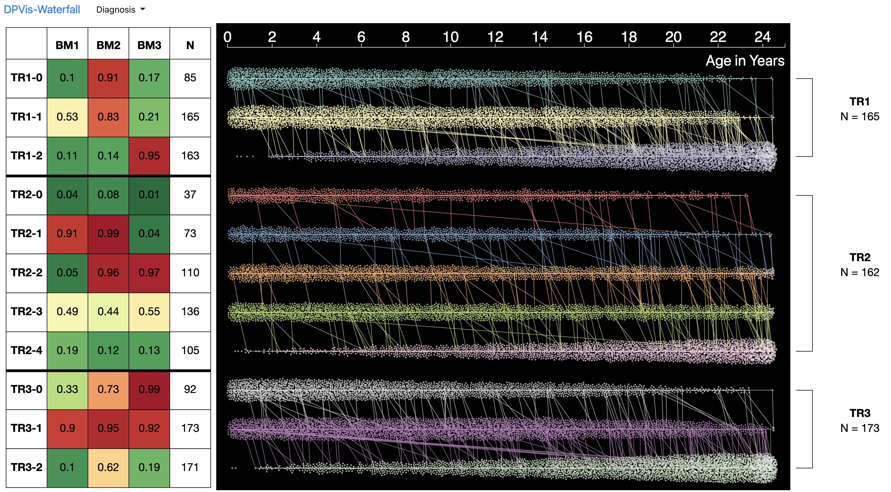

# DPVis Waterfall Diagram
<br>

<br>
DPVis-Waterfall is a Flask application for presenting disease progression pathways. It visualizes sequences of hidden states, learned by Hidden Markov Models, over time on longitudinal observational data. 
<br>
We used the source code to visualize figures in the paper published by Nature Communications:
<br>

> [**Progression of type 1 diabetes from latency to symptomatic disease is predicted by distinct autoimmune trajectories**](https://www.nature.com/articles/s41467-022-28909-1),            
> Bum Chul Kwon, Vibha Anand, Peter Achenbach, Jessica L Dunne, William Hagopian, Jianying Hu, Eileen Koski, Åke Lernmark, Markus Lundgren, Kenney Ng, Jorma Toppari, Jorma Veijola, Brigitte I Frohnert, the T1DI Study Group  
> Nature Communications, 2022

<br>

The full-fledge visualization system was introduced in the following paper published by IEEE TVCG.
<br>

> [**DPVis: Visual Analytics with Hidden Markov Models for Disease Progression Pathways**](https://www.bckwon.com/publication/dpvis/),            
> Bum Chul Kwon, Vibha Anand, Kristen A Severson, Soumya Ghosh, Zhaonan Sun, Brigitte I Frohnert, Markus Lundgren, Kenney Ng   
> IEEE Transactions on Visualization and Computer Graphics (TVCG), 2020
> *arXiv preprint ([arXiv 1904.11652](https://arxiv.org/abs/1904.11652))*

## Requirements

Python 3.7.4

## Installation

Use the package manager [pip](https://pip.pypa.io/en/stable/) to install packages. 

```bash
pip install -r requirements.txt
```

## Usage

Run Flask Server on the Project Root Directory.

```bash
python app.py
```

While the server is running, launch a modern web browser (e.g., Firefox) and go to [https://localhost:4848](https://localhost:4848). It may take 1-3 minutes to completely load the page depending on the computing environment. 

For demonstration, we use a synthetic dataset: `/static/data/dpvis-csv-file.csv`